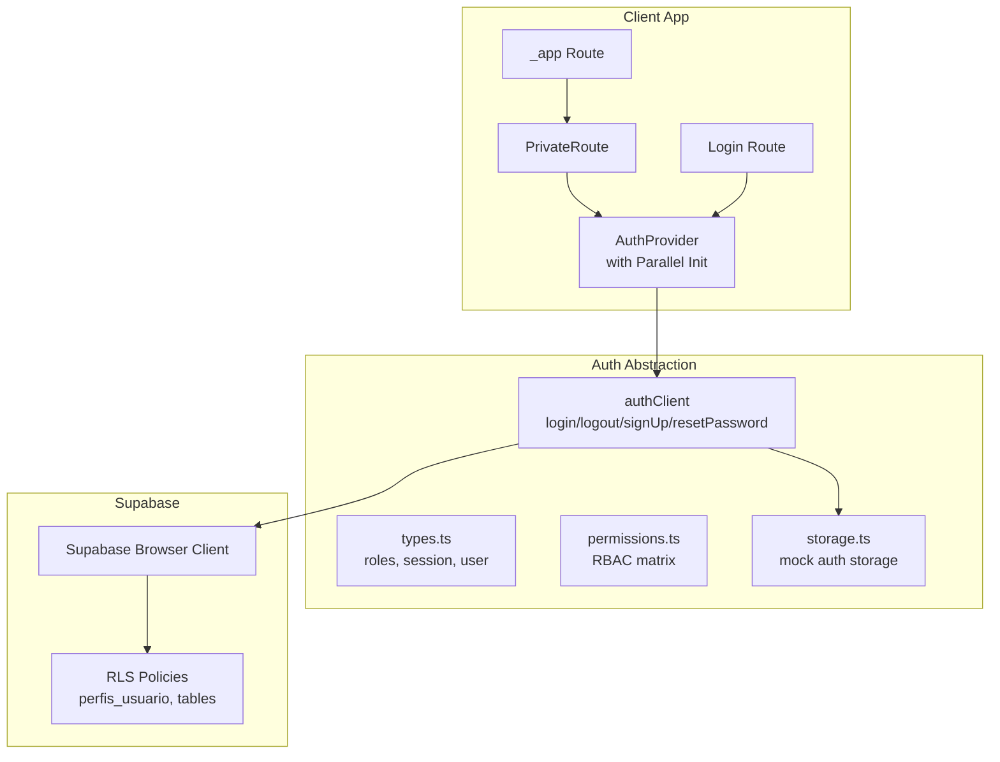
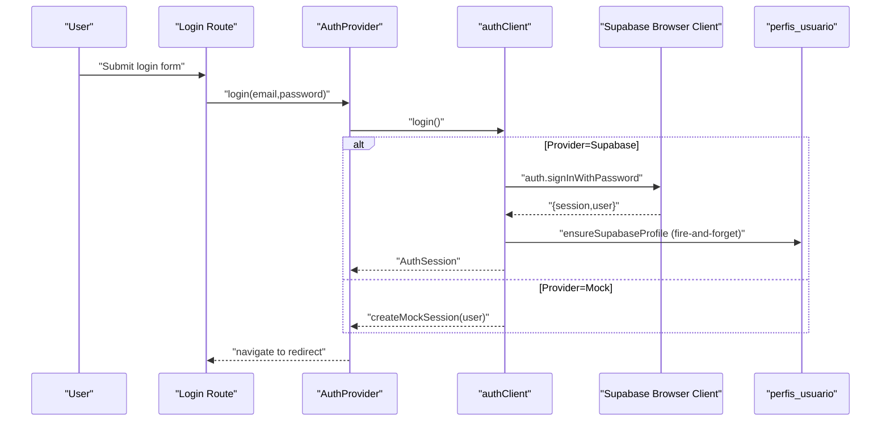
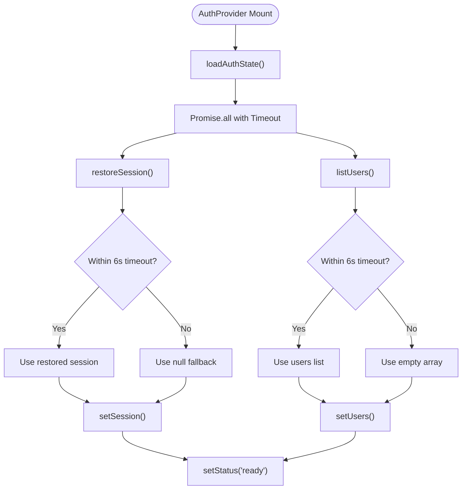
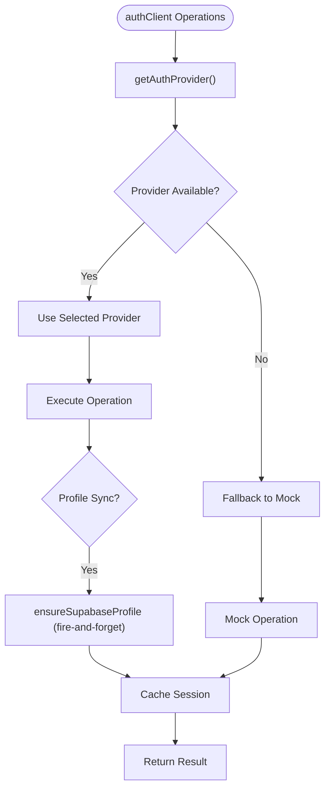
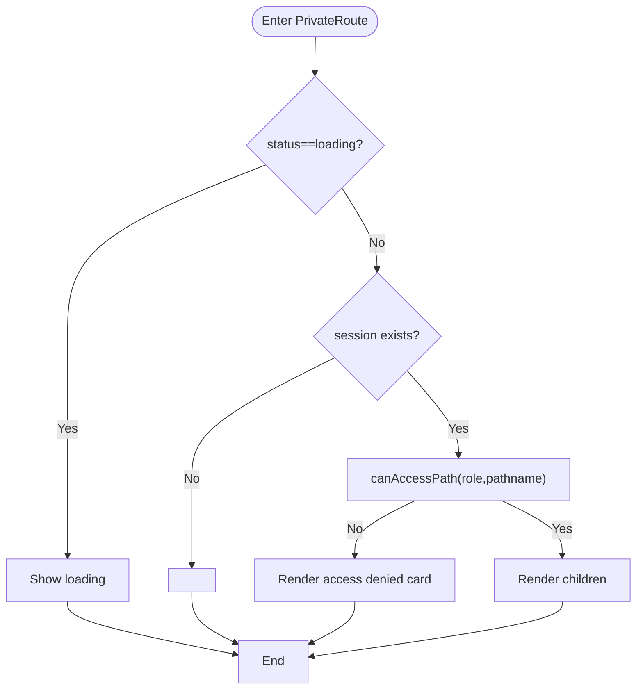
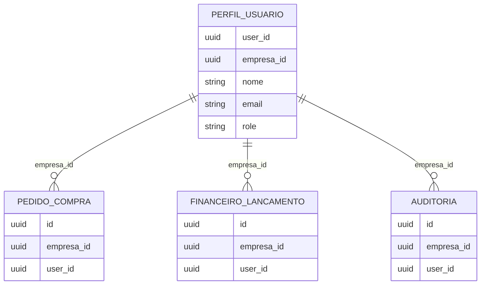
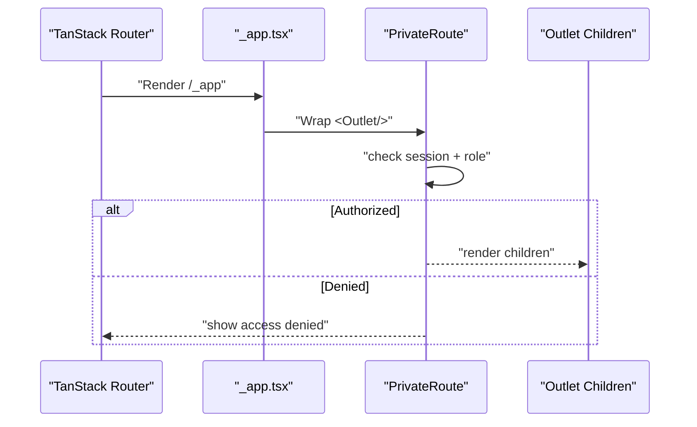
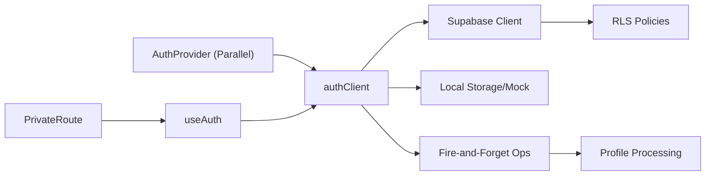

# Authentication & Authorization

<cite>
**Referenced Files in This Document**
- [PrivateRoute.tsx](file://src/components/auth/PrivateRoute.tsx)
- [context.tsx](file://src/lib/auth/context.tsx)
- [client.ts](file://src/lib/auth/client.ts)
- [types.ts](file://src/lib/auth/types.ts)
- [login.tsx](file://src/routes/login.tsx)
- [_app.tsx](file://src/routes/_app.tsx)
- [permissions.ts](file://src/lib/auth/permissions.ts)
- [storage.ts](file://src/lib/auth/storage.ts)
- [20260512055519_auth_rls_empresa_access_mvp.sql](file://supabase/migrations/20260512055519_auth_rls_empresa_access_mvp.sql)
- [20260512100000_sprint12a_pedidos_compra.sql](file://supabase/migrations/20260512100000_sprint12a_pedidos_compra.sql)
- [20260512110000_sprint13_financeiro_core.sql](file://supabase/migrations/20260512110000_sprint13_financeiro_core.sql)
- [20260512170000_sprint17_auditoria.sql](file://supabase/migrations/20260512170000_sprint17_auditoria.sql)
- [auth-supabase.spec.ts](file://tests/e2e/auth-supabase.spec.ts)
- [auth-ui.spec.ts](file://tests/e2e/auth-ui.spec.ts)
</cite>

## Update Summary
**Changes Made**
- Enhanced AuthProvider with parallel session restoration and timeout protection (6-second timeout)
- Added fire-and-forget operations for profile creation in authentication flows
- Improved provider fallback mechanisms with automatic switching between Supabase and mock implementations
- Updated authentication initialization to use Promise.all with timeout protection
- Enhanced error handling and graceful degradation for authentication failures
- Improved Supabase client with better error handling and profile resolution
- Enhanced parallel profile fetching capabilities across authentication operations

## Table of Contents
1. [Introduction](#introduction)
2. [Project Structure](#project-structure)
3. [Core Components](#core-components)
4. [Architecture Overview](#architecture-overview)
5. [Detailed Component Analysis](#detailed-component-analysis)
6. [Dependency Analysis](#dependency-analysis)
7. [Performance Considerations](#performance-considerations)
8. [Troubleshooting Guide](#troubleshooting-guide)
9. [Conclusion](#conclusion)
10. [Appendices](#appendices)

## Introduction
This document explains the authentication and authorization system for AllVidros. It covers the multi-provider authentication (Supabase Auth and mock provider), session management, JWT token handling, user context, role-based access control (RBAC), Row Level Security (RLS) policies for multi-tenant isolation, protected routing via PrivateRoute, and integration with external providers. The system now features enhanced parallel session restoration, timeout protection, and improved provider fallback mechanisms with fire-and-forget operations for profile creation.

## Project Structure
Authentication and authorization logic is organized around:
- A React context provider that exposes authentication actions and state with parallel initialization
- An abstraction layer that supports either Supabase Auth or a mock provider with automatic fallback
- A private route wrapper that enforces RBAC checks
- Supabase RLS policies ensuring tenant isolation
- Fire-and-forget operations for background profile synchronization



**Diagram sources**
- [context.tsx:36-57](file://src/lib/auth/context.tsx#L36-L57)
- [client.ts:187-459](file://src/lib/auth/client.ts#L187-L459)
- [permissions.ts:1-91](file://src/lib/auth/permissions.ts#L1-L91)
- [storage.ts:1-127](file://src/lib/auth/storage.ts#L1-L127)

**Section sources**
- [context.tsx:36-57](file://src/lib/auth/context.tsx#L36-L57)
- [client.ts:187-459](file://src/lib/auth/client.ts#L187-L459)
- [permissions.ts:1-91](file://src/lib/auth/permissions.ts#L1-L91)
- [storage.ts:1-127](file://src/lib/auth/storage.ts#L1-L127)

## Core Components
- **Enhanced AuthProvider**: Provides authentication state and actions with parallel session restoration and timeout protection
- **authClient**: Multi-provider client with automatic fallback, fire-and-forget profile operations, and improved error handling
- **PrivateRoute**: Enforces authentication and RBAC checks before rendering child routes
- **Login route**: Provides UI for login/register/forgot flows with provider-aware messaging
- **Roles and types**: Define user roles, labels, and session shape
- **Permissions module**: Centralized RBAC matrix for role-based access control
- **Storage module**: Local storage abstraction for mock authentication

Key responsibilities:
- Parallel session restoration with timeout protection (6 seconds)
- Automatic provider fallback between Supabase and mock implementations
- Fire-and-forget profile creation and synchronization
- User profile mapping and role normalization
- Protected route enforcement with comprehensive access control

**Section sources**
- [context.tsx:36-125](file://src/lib/auth/context.tsx#L36-L125)
- [client.ts:187-459](file://src/lib/auth/client.ts#L187-L459)
- [permissions.ts:40-91](file://src/lib/auth/permissions.ts#L40-L91)
- [storage.ts:109-127](file://src/lib/auth/storage.ts#L109-L127)

## Architecture Overview
The system supports two authentication providers with enhanced reliability:
- **Supabase Auth**: Uses Supabase browser client for sign-in, sign-up, password reset, and session retrieval with automatic profile synchronization
- **Mock provider**: Uses in-memory storage for users and sessions during development with comprehensive user fixtures



**Diagram sources**
- [login.tsx:61-74](file://src/routes/login.tsx#L61-L74)
- [context.tsx:63-68](file://src/lib/auth/context.tsx#L63-L68)
- [client.ts:192-230](file://src/lib/auth/client.ts#L192-L230)

**Section sources**
- [client.ts:187-230](file://src/lib/auth/client.ts#L187-L230)
- [context.tsx:63-68](file://src/lib/auth/context.tsx#L63-L68)
- [login.tsx:61-74](file://src/routes/login.tsx#L61-L74)

## Detailed Component Analysis

### Enhanced AuthProvider: Parallel Initialization and Timeout Protection
The AuthProvider now implements parallel session restoration with timeout protection to improve initialization performance and reliability.



**Diagram sources**
- [context.tsx:41-57](file://src/lib/auth/context.tsx#L41-L57)
- [context.tsx:28-34](file://src/lib/auth/context.tsx#L28-L34)

**Section sources**
- [context.tsx:28-34](file://src/lib/auth/context.tsx#L28-L34)
- [context.tsx:41-57](file://src/lib/auth/context.tsx#L41-L57)

### authClient: Enhanced Multi-Provider Authentication
The authClient now features automatic provider fallback, fire-and-forget operations, and improved error handling for better reliability.

**Updated** Enhanced with parallel session restoration, timeout protection, and automatic provider switching



**Diagram sources**
- [client.ts:187-190](file://src/lib/auth/client.ts#L187-L190)
- [client.ts:208-209](file://src/lib/auth/client.ts#L208-L209)
- [client.ts:257-258](file://src/lib/auth/client.ts#L257-L258)

**Section sources**
- [client.ts:187-190](file://src/lib/auth/client.ts#L187-L190)
- [client.ts:208-209](file://src/lib/auth/client.ts#L208-L209)
- [client.ts:257-258](file://src/lib/auth/client.ts#L257-L258)

### PrivateRoute: Protected Routes with Enhanced RBAC
- Blocks unauthenticated users with redirect to login
- Enforces RBAC via canAccessPath against the current user role and requested path
- Renders a friendly access-denied page with logout option



**Diagram sources**
- [PrivateRoute.tsx:8-56](file://src/components/auth/PrivateRoute.tsx#L8-L56)

**Section sources**
- [PrivateRoute.tsx:8-56](file://src/components/auth/PrivateRoute.tsx#L8-L56)

### Login Route: Provider-Aware Authentication Interface
- Handles three modes: login, register, forgot password
- Uses provider-specific hints and messages
- Validates inputs and shows errors/success messages
- Redirects to safe path after successful auth

**Section sources**
- [login.tsx:131-133](file://src/routes/login.tsx#L131-L133)
- [login.tsx:177-181](file://src/routes/login.tsx#L177-L181)

### Role-Based Access Control (RBAC)
- Roles are defined centrally and labeled for UI
- Super admin is a special role with elevated privileges
- PrivateRoute enforces access per role and path

```mermaid
classDiagram
class UserRole {
<<enumeration>>
"superadmin"
"admin"
"gestor"
"vendedor"
"tecnico"
"financeiro"
}
class AuthUser {
+string id
+string name
+string email
+UserRole role
}
class AuthSession {
+AuthUser user
+string accessToken
+string expiresAt
}
class Types {
+USER_ROLES
+ROLE_LABELS
+SUPERADMIN_EMAIL
+isSuperAdmin(email) boolean
}
Types --> UserRole : "defines"
AuthSession --> AuthUser : "contains"
```

**Diagram sources**
- [types.ts:1-31](file://src/lib/auth/types.ts#L1-L31)

**Section sources**
- [types.ts:1-31](file://src/lib/auth/types.ts#L1-L31)
- [PrivateRoute.tsx:24-25](file://src/components/auth/PrivateRoute.tsx#L24-L25)

### Row Level Security (RLS) and Multi-Tenant Isolation
- RLS policies restrict access to rows based on empresa_id and user role
- perfis_usuario stores user profiles per empresa_id
- Additional migrations define RLS for purchase orders, financial core, audit, and other tables



**Diagram sources**
- [20260512055519_auth_rls_empresa_access_mvp.sql](file://supabase/migrations/20260512055519_auth_rls_empresa_access_mvp.sql)
- [20260512100000_sprint12a_pedidos_compra.sql](file://supabase/migrations/20260512100000_sprint12a_pedidos_compra.sql)
- [20260512110000_sprint13_financeiro_core.sql](file://supabase/migrations/20260512110000_sprint13_financeiro_core.sql)
- [20260512170000_sprint17_auditoria.sql](file://supabase/migrations/20260512170000_sprint17_auditoria.sql)

**Section sources**
- [client.ts:81-132](file://src/lib/auth/client.ts#L81-L132)
- [20260512055519_auth_rls_empresa_access_mvp.sql](file://supabase/migrations/20260512055519_auth_rls_empresa_access_mvp.sql)
- [20260512100000_sprint12a_pedidos_compra.sql](file://supabase/migrations/20260512100000_sprint12a_pedidos_compra.sql)
- [20260512110000_sprint13_financeiro_core.sql](file://supabase/migrations/20260512110000_sprint13_financeiro_core.sql)
- [20260512170000_sprint17_auditoria.sql](file://supabase/migrations/20260512170000_sprint17_auditoria.sql)

### Protected Route Pattern
- Wrap route groups with PrivateRoute to enforce auth and RBAC
- Use route guards to protect nested routes under /_app



**Diagram sources**
- [_app.tsx:10-25](file://src/routes/_app.tsx#L10-L25)
- [PrivateRoute.tsx:8-56](file://src/components/auth/PrivateRoute.tsx#L8-L56)

**Section sources**
- [_app.tsx:6-25](file://src/routes/_app.tsx#L6-L25)
- [PrivateRoute.tsx:8-56](file://src/components/auth/PrivateRoute.tsx#L8-L56)

## Dependency Analysis
- **Enhanced AuthProvider**: Depends on authClient for all operations with parallel initialization
- **authClient**: Depends on Supabase browser client when provider is Supabase and on local storage when mock
- **PrivateRoute**: Depends on useAuth and permission checks via permissions module
- **Supabase RLS**: Depends on empresa_id and user role fields in tables
- **Fire-and-forget operations**: Profile synchronization runs independently without blocking user flows



**Diagram sources**
- [context.tsx:41-57](file://src/lib/auth/context.tsx#L41-L57)
- [client.ts:208-209](file://src/lib/auth/client.ts#L208-L209)
- [client.ts:257-258](file://src/lib/auth/client.ts#L257-L258)

**Section sources**
- [context.tsx:41-57](file://src/lib/auth/context.tsx#L41-L57)
- [client.ts:208-209](file://src/lib/auth/client.ts#L208-L209)
- [client.ts:257-258](file://src/lib/auth/client.ts#L257-L258)

## Performance Considerations
- **Parallel initialization**: AuthProvider uses Promise.all to restore session and list users concurrently
- **Timeout protection**: 6-second timeout prevents hanging during authentication initialization
- **Fire-and-forget operations**: Profile creation runs asynchronously without blocking user experience
- **Provider detection**: Environment variables are checked once to decide provider with automatic fallback
- **Minimal re-renders**: useAuth memoizes context value to prevent unnecessary updates
- **RLS efficiency**: Ensure empresa_id and user_id are indexed in tables to speed up policy evaluation

**Updated** Enhanced with parallel processing and timeout protection for improved performance

**Section sources**
- [context.tsx:44-46](file://src/lib/auth/context.tsx#L44-L46)
- [context.tsx:28-34](file://src/lib/auth/context.tsx#L28-L34)
- [client.ts:208-209](file://src/lib/auth/client.ts#L208-L209)

## Troubleshooting Guide
Common issues and resolutions:
- **Supabase credentials missing**: Provider automatically falls back to mock; verify environment variables for production
- **Expired session**: restoreSession clears expired sessions and logs out; ensure client-side time is correct
- **Role conflicts**: Super admin accounts cannot have their roles changed; check isSuperAdmin logic
- **Access denied**: Verify user role and path permissions; confirm canAccessPath mapping
- **Initialization timeouts**: Parallel operations timeout after 6 seconds; check network connectivity
- **Profile synchronization failures**: Fire-and-forget operations continue even if profile creation fails

**Updated** Enhanced with timeout handling and fire-and-forget operation considerations

**Section sources**
- [context.tsx:28-34](file://src/lib/auth/context.tsx#L28-L34)
- [client.ts:266-269](file://src/lib/auth/client.ts#L266-L269)
- [client.ts:333-335](file://src/lib/auth/client.ts#L333-L335)
- [PrivateRoute.tsx:24-25](file://src/components/auth/PrivateRoute.tsx#L24-L25)

## Conclusion
AllVidros implements a robust, extensible authentication and authorization system with multi-provider support, secure session handling, and strong tenant isolation via RLS. The enhanced system now features parallel session restoration, timeout protection, automatic provider fallback, and fire-and-forget operations for improved reliability and user experience. The design cleanly separates concerns between the UI, context/provider, and provider abstraction, enabling easy testing and future enhancements.

## Appendices

### Security Best Practices
- Always use HTTPS in production
- Store tokens securely; rely on Supabase Auth for token management when using Supabase provider
- Validate and sanitize all inputs in login/register flows
- Regularly review RLS policies and indexes
- Limit sensitive operations to superadmin or admin roles
- Monitor fire-and-forget operation failures for profile synchronization

**Updated** Added monitoring recommendations for fire-and-forget operations

### Implementing New Authenticated Features
- Wrap route groups with PrivateRoute to enforce auth and RBAC
- Use useAuth to access session and perform actions (login, logout, sign up)
- For Supabase provider, ensure RLS policies exist for new tables and include empresa_id and user_id fields
- Add role checks in components using session.user.role and appropriate UI guards
- Leverage fire-and-forget operations for background tasks that shouldn't block user flows

**Updated** Enhanced with fire-and-forget operation guidance

### Example: Using useAuth in a Component
- Import useAuth from the auth context
- Call login, logout, or refreshUsers as needed
- Read session.status and session.user to render UI conditionally
- Handle parallel initialization states during authentication loading

**Section sources**
- [context.tsx:116-122](file://src/lib/auth/context.tsx#L116-L122)
- [login.tsx:25](file://src/routes/login.tsx#L25)

### Testing Notes
- End-to-end tests cover Supabase and UI auth flows
- Use these tests as references for expected behavior and error handling
- Test parallel initialization scenarios and timeout conditions
- Verify fire-and-forget operation resilience

**Updated** Added testing considerations for enhanced authentication features

**Section sources**
- [auth-supabase.spec.ts](file://tests/e2e/auth-supabase.spec.ts)
- [auth-ui.spec.ts](file://tests/e2e/auth-ui.spec.ts)