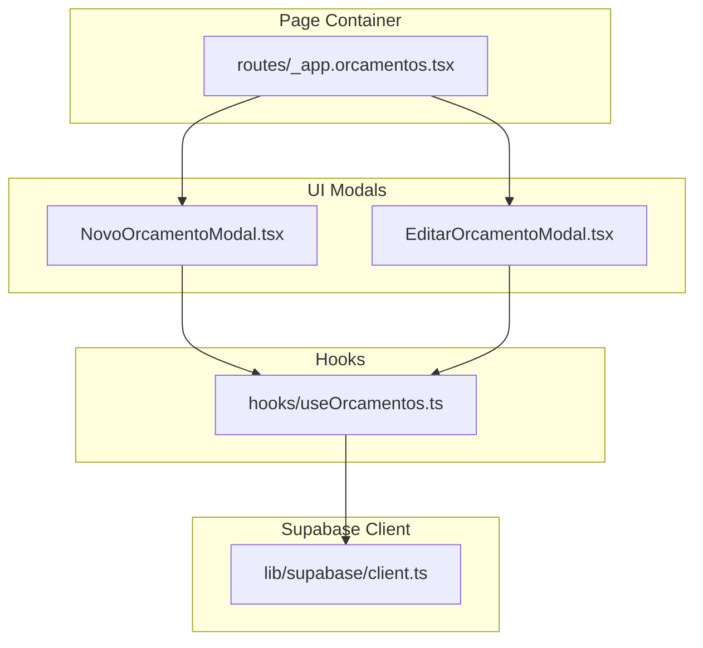
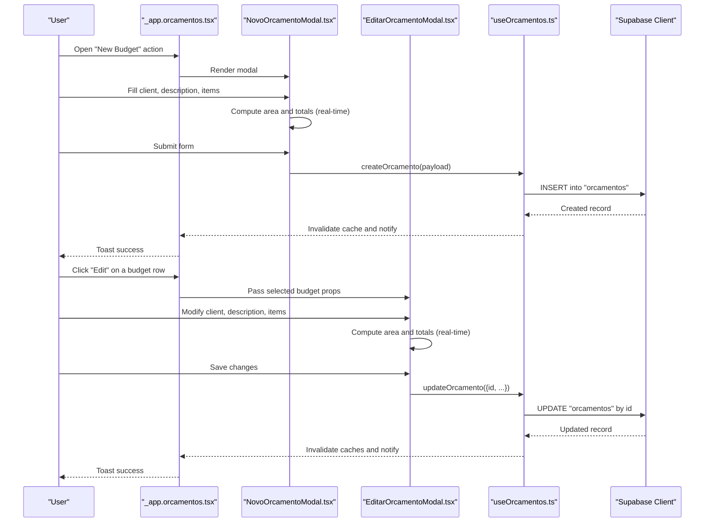
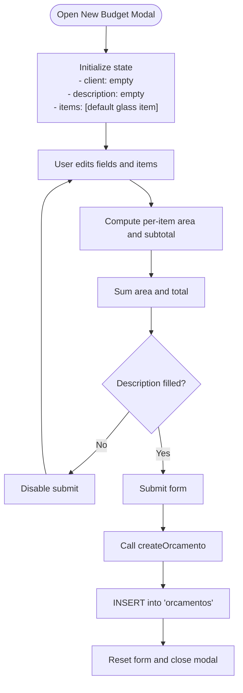
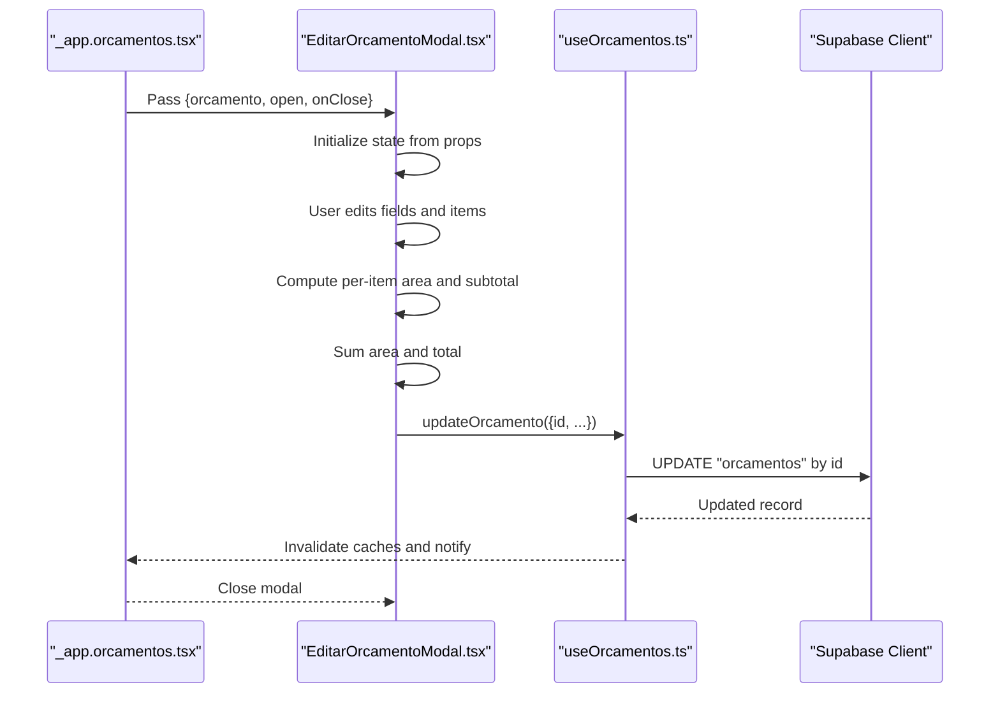
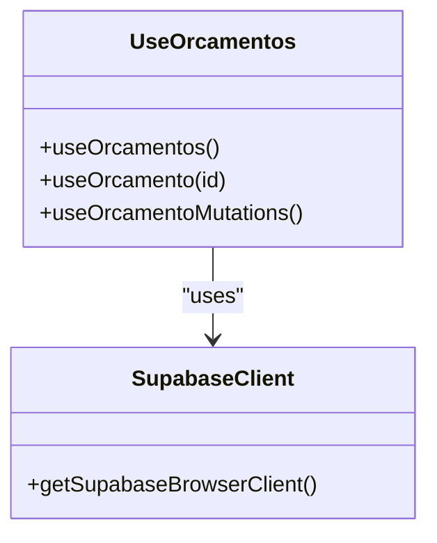
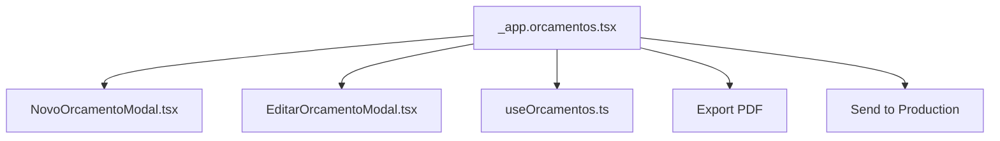
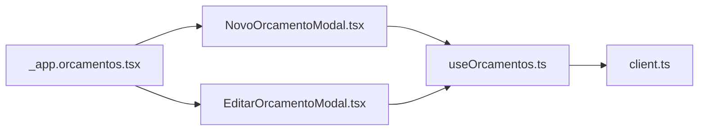

# Budget Creation and Editing

<cite>
**Referenced Files in This Document**
- [NovoOrcamentoModal.tsx](file://src/components/features/orcamentos/NovoOrcamentoModal.tsx)
- [EditarOrcamentoModal.tsx](file://src/components/features/orcamentos/EditarOrcamentoModal.tsx)
- [useOrcamentos.ts](file://src/hooks/useOrcamentos.ts)
- [_app.orcamentos.tsx](file://src/routes/_app.orcamentos.tsx)
- [client.ts](file://src/lib/supabase/client.ts)
</cite>

## Table of Contents
1. [Introduction](#introduction)
2. [Project Structure](#project-structure)
3. [Core Components](#core-components)
4. [Architecture Overview](#architecture-overview)
5. [Detailed Component Analysis](#detailed-component-analysis)
6. [Dependency Analysis](#dependency-analysis)
7. [Performance Considerations](#performance-considerations)
8. [Troubleshooting Guide](#troubleshooting-guide)
9. [Conclusion](#conclusion)

## Introduction
This document explains the budget creation and editing workflow in the Vidraçaria TOP application. It focuses on the modal-based interface for creating new budgets and editing existing ones, including form validation, real-time calculations, and data persistence. It also covers adding/removing budget items, configuring glass types and processing options, managing client associations, state management patterns, form handling, and integration with the Supabase backend via custom hooks. Practical examples, common user interactions, and error handling strategies are included, along with the relationship between budget items and pricing calculations.

## Project Structure
The budget workflow spans UI modals, a page container, and shared hooks for data fetching and mutations. The Supabase client is initialized once and reused across hooks.

**Diagram sources**
- [NovoOrcamentoModal.tsx:1-255](file://src/components/features/orcamentos/NovoOrcamentoModal.tsx#L1-L255)
- [EditarOrcamentoModal.tsx:1-241](file://src/components/features/orcamentos/EditarOrcamentoModal.tsx#L1-L241)
- [_app.orcamentos.tsx:1-345](file://src/routes/_app.orcamentos.tsx#L1-L345)
- [useOrcamentos.ts:1-132](file://src/hooks/useOrcamentos.ts#L1-L132)
- [client.ts:1-26](file://src/lib/supabase/client.ts#L1-L26)

**Section sources**
- [NovoOrcamentoModal.tsx:1-255](file://src/components/features/orcamentos/NovoOrcamentoModal.tsx#L1-L255)
- [EditarOrcamentoModal.tsx:1-241](file://src/components/features/orcamentos/EditarOrcamentoModal.tsx#L1-L241)
- [_app.orcamentos.tsx:1-345](file://src/routes/_app.orcamentos.tsx#L1-L345)
- [useOrcamentos.ts:1-132](file://src/hooks/useOrcamentos.ts#L1-L132)
- [client.ts:1-26](file://src/lib/supabase/client.ts#L1-L26)

## Core Components
- New Budget Modal: Provides a form to create a new budget with client selection, description, and a dynamic list of glass items. Real-time calculations show per-item area and subtotal, and a summary totals the area and value.
- Edit Budget Modal: Allows editing an existing budget’s client, description, and items. Mirrors the creation flow with real-time updates and a summary.
- Budget Hooks: Encapsulate Supabase queries and mutations for budgets, including create, update, delete, and query invalidation.
- Page Container: Hosts the modals, displays the budget list, and orchestrates actions like exporting to PDF and sending approved budgets to production.

Key responsibilities:
- Form state management for client association, description, and items.
- Real-time calculation pipeline for area and total value.
- Persistence via Supabase mutations with optimistic UI and toast feedback.
- Validation constraints enforced at the UI level and backend.

**Section sources**
- [NovoOrcamentoModal.tsx:31-93](file://src/components/features/orcamentos/NovoOrcamentoModal.tsx#L31-L93)
- [EditarOrcamentoModal.tsx:50-108](file://src/components/features/orcamentos/EditarOrcamentoModal.tsx#L50-L108)
- [useOrcamentos.ts:58-131](file://src/hooks/useOrcamentos.ts#L58-L131)
- [_app.orcamentos.tsx:47-140](file://src/routes/_app.orcamentos.tsx#L47-L140)

## Architecture Overview
The workflow integrates UI modals with React state, TanStack Query for caching and mutations, and Supabase for persistence. The page container coordinates actions and passes selected budgets to the edit modal.

**Diagram sources**
- [_app.orcamentos.tsx:142-148](file://src/routes/_app.orcamentos.tsx#L142-L148)
- [NovoOrcamentoModal.tsx:67-87](file://src/components/features/orcamentos/NovoOrcamentoModal.tsx#L67-L87)
- [EditarOrcamentoModal.tsx:97-108](file://src/components/features/orcamentos/EditarOrcamentoModal.tsx#L97-L108)
- [useOrcamentos.ts:63-103](file://src/hooks/useOrcamentos.ts#L63-L103)
- [client.ts:5-25](file://src/lib/supabase/client.ts#L5-L25)

## Detailed Component Analysis

### New Budget Modal
Responsibilities:
- Manage local form state for client, description, and items.
- Add/remove budget items dynamically.
- Compute per-item area and subtotal, and totals for area and value.
- Persist to Supabase via mutation hook.
- Provide user feedback via loading states and toasts.

Real-time calculations:
- Per-item area and subtotal computed from item dimensions, glass type price, and processing cost.
- Area total and budget total derived from item-level calculations.

Validation:
- Description is required to enable submission.
- At least one item must exist.

Persistence:
- Generates a budget number and expiration date.
- Inserts a new budget record with calculated totals.

**Diagram sources**
- [NovoOrcamentoModal.tsx:31-93](file://src/components/features/orcamentos/NovoOrcamentoModal.tsx#L31-L93)
- [NovoOrcamentoModal.tsx:42-51](file://src/components/features/orcamentos/NovoOrcamentoModal.tsx#L42-L51)
- [NovoOrcamentoModal.tsx:67-87](file://src/components/features/orcamentos/NovoOrcamentoModal.tsx#L67-L87)

**Section sources**
- [NovoOrcamentoModal.tsx:31-93](file://src/components/features/orcamentos/NovoOrcamentoModal.tsx#L31-L93)
- [NovoOrcamentoModal.tsx:113-138](file://src/components/features/orcamentos/NovoOrcamentoModal.tsx#L113-L138)
- [NovoOrcamentoModal.tsx:148-227](file://src/components/features/orcamentos/NovoOrcamentoModal.tsx#L148-L227)
- [NovoOrcamentoModal.tsx:229-240](file://src/components/features/orcamentos/NovoOrcamentoModal.tsx#L229-L240)
- [NovoOrcamentoModal.tsx:242-250](file://src/components/features/orcamentos/NovoOrcamentoModal.tsx#L242-L250)

### Edit Budget Modal
Responsibilities:
- Initialize state from an existing budget record.
- Allow editing client, description, and items.
- Keep UI synchronized when the underlying budget changes externally.
- Persist updates via mutation hook.

Real-time calculations:
- Mirror the creation flow for per-item and total computations.

Validation:
- Description is required to enable submission.
- At least one item must exist.

**Diagram sources**
- [_app.orcamentos.tsx:334-341](file://src/routes/_app.orcamentos.tsx#L334-L341)
- [EditarOrcamentoModal.tsx:50-108](file://src/components/features/orcamentos/EditarOrcamentoModal.tsx#L50-L108)
- [useOrcamentos.ts:83-103](file://src/hooks/useOrcamentos.ts#L83-L103)

**Section sources**
- [EditarOrcamentoModal.tsx:50-108](file://src/components/features/orcamentos/EditarOrcamentoModal.tsx#L50-L108)
- [EditarOrcamentoModal.tsx:120-147](file://src/components/features/orcamentos/EditarOrcamentoModal.tsx#L120-L147)
- [EditarOrcamentoModal.tsx:157-214](file://src/components/features/orcamentos/EditarOrcamentoModal.tsx#L157-L214)
- [EditarOrcamentoModal.tsx:217-228](file://src/components/features/orcamentos/EditarOrcamentoModal.tsx#L217-L228)
- [EditarOrcamentoModal.tsx:230-236](file://src/components/features/orcamentos/EditarOrcamentoModal.tsx#L230-L236)

### Budget Hooks and Supabase Integration
Responsibilities:
- Query budgets and a single budget with proper filtering and joins.
- Provide mutations for create, update, delete with error handling and cache invalidation.
- Initialize Supabase client with environment credentials.

**Diagram sources**
- [useOrcamentos.ts:11-56](file://src/hooks/useOrcamentos.ts#L11-L56)
- [useOrcamentos.ts:58-131](file://src/hooks/useOrcamentos.ts#L58-L131)
- [client.ts:5-25](file://src/lib/supabase/client.ts#L5-L25)

**Section sources**
- [useOrcamentos.ts:11-56](file://src/hooks/useOrcamentos.ts#L11-L56)
- [useOrcamentos.ts:58-131](file://src/hooks/useOrcamentos.ts#L58-L131)
- [client.ts:5-25](file://src/lib/supabase/client.ts#L5-L25)

### Page Container Orchestration
Responsibilities:
- Display the budget list with status badges and actions.
- Open the new budget modal and the edit modal with selected budget.
- Export budgets to PDF and send approved budgets to production.
- Provide a quick calculator tab for rapid quoting.

**Diagram sources**
- [_app.orcamentos.tsx:142-148](file://src/routes/_app.orcamentos.tsx#L142-L148)
- [_app.orcamentos.tsx:334-341](file://src/routes/_app.orcamentos.tsx#L334-L341)
- [_app.orcamentos.tsx:123-135](file://src/routes/_app.orcamentos.tsx#L123-L135)
- [_app.orcamentos.tsx:94-121](file://src/routes/_app.orcamentos.tsx#L94-L121)

**Section sources**
- [_app.orcamentos.tsx:47-140](file://src/routes/_app.orcamentos.tsx#L47-L140)
- [_app.orcamentos.tsx:142-148](file://src/routes/_app.orcamentos.tsx#L142-L148)
- [_app.orcamentos.tsx:334-341](file://src/routes/_app.orcamentos.tsx#L334-L341)

## Dependency Analysis
- Modals depend on:
  - Client selection via a client hook.
  - Budget mutations via the budget hooks.
  - Calculation utilities for real-time totals.
- Budget hooks depend on:
  - Supabase client initialization.
  - TanStack Query for caching and invalidation.
- Page container depends on:
  - Modals and hooks to render and manage state.
  - Actions for PDF export and production conversion.

**Diagram sources**
- [NovoOrcamentoModal.tsx:21-28](file://src/components/features/orcamentos/NovoOrcamentoModal.tsx#L21-L28)
- [EditarOrcamentoModal.tsx:20-28](file://src/components/features/orcamentos/EditarOrcamentoModal.tsx#L20-L28)
- [useOrcamentos.ts:1-10](file://src/hooks/useOrcamentos.ts#L1-L10)
- [client.ts:1-26](file://src/lib/supabase/client.ts#L1-L26)
- [_app.orcamentos.tsx:19-33](file://src/routes/_app.orcamentos.tsx#L19-L33)

**Section sources**
- [NovoOrcamentoModal.tsx:21-28](file://src/components/features/orcamentos/NovoOrcamentoModal.tsx#L21-L28)
- [EditarOrcamentoModal.tsx:20-28](file://src/components/features/orcamentos/EditarOrcamentoModal.tsx#L20-L28)
- [useOrcamentos.ts:1-10](file://src/hooks/useOrcamentos.ts#L1-L10)
- [_app.orcamentos.tsx:19-33](file://src/routes/_app.orcamentos.tsx#L19-L33)

## Performance Considerations
- Memoization:
  - Real-time calculations are memoized to avoid recomputation on unrelated state changes.
- Minimal re-renders:
  - Local state updates for items are scoped to the modal components.
- Query invalidation:
  - After mutations, caches are invalidated to keep the UI in sync with the backend.
- Environment checks:
  - Supabase client initialization validates environment variables to prevent runtime errors.

[No sources needed since this section provides general guidance]

## Troubleshooting Guide
Common issues and strategies:
- Missing Supabase credentials:
  - The client initializer throws an error if environment variables are missing. Verify configuration.
- Mutation errors:
  - Toast notifications surface errors during create/update/delete operations. Check backend logs and network requests.
- Empty or invalid items:
  - Ensure at least one item exists and numeric fields are valid before submitting.
- Client association:
  - If a client is optional, ensure null is handled properly on the backend.
- Real-time calculation discrepancies:
  - Confirm that item indices match the memoized arrays and that default values are set consistently.

**Section sources**
- [client.ts:9-13](file://src/lib/supabase/client.ts#L9-L13)
- [useOrcamentos.ts:78-80](file://src/hooks/useOrcamentos.ts#L78-L80)
- [useOrcamentos.ts:100-102](file://src/hooks/useOrcamentos.ts#L100-L102)
- [useOrcamentos.ts:118-120](file://src/hooks/useOrcamentos.ts#L118-L120)
- [NovoOrcamentoModal.tsx:67-87](file://src/components/features/orcamentos/NovoOrcamentoModal.tsx#L67-L87)
- [EditarOrcamentoModal.tsx:97-108](file://src/components/features/orcamentos/EditarOrcamentoModal.tsx#L97-L108)

## Conclusion
The budget creation and editing workflow leverages modal-based UI, robust state management, and TanStack Query to deliver a responsive experience. Real-time calculations provide immediate feedback, while Supabase-backed mutations ensure reliable persistence. The page container orchestrates actions and maintains a clean separation of concerns across components. By following the validation and error-handling patterns outlined here, teams can maintain consistency and reliability in budget-related operations.