# Frontend Architecture

<cite>
**Referenced Files in This Document**
- [package.json](file://package.json)
- [components.json](file://components.json)
- [src/router.tsx](file://src/router.tsx)
- [src/routes/__root.tsx](file://src/routes/__root.tsx)
- [src/styles.css](file://src/styles.css)
- [src/components/ui/button.tsx](file://src/components/ui/button.tsx)
- [src/components/ui/form.tsx](file://src/components/ui/form.tsx)
- [src/hooks/use-mobile.tsx](file://src/hooks/use-mobile.tsx)
- [src/hooks/useOrcamentos.ts](file://src/hooks/useOrcamentos.ts)
- [src/hooks/compras/useFornecedores.ts](file://src/hooks/compras/useFornecedores.ts)
- [src/lib/auth/context.tsx](file://src/lib/auth/context.tsx)
- [src/lib/mock/data.ts](file://src/lib/mock/data.ts)
- [src/hooks/useProdutos.ts](file://src/hooks/useProdutos.ts)
- [tests/unit/produtos/busca-por-codigo.test.ts](file://tests/unit/produtos/busca-por-codigo.test.ts)
- [tests/unit/produtos/servico-componentes.test.ts](file://tests/unit/produtos/servico-componentes.test.ts)
- [tests/helpers/factories.ts](file://tests/helpers/factories.ts)
</cite>

## Update Summary
**Changes Made**
- Enhanced Product Catalog System: Added comprehensive product catalog with 37 standardized products and 27 services with detailed component definitions
- Improved Mock Data Infrastructure: Expanded mock data system with structured product codes, standardized pricing, and service component hierarchies
- Strengthened Testing Framework: Added extensive unit tests covering product catalog validation and service component relationships
- Enhanced Service Definition System: Implemented detailed service composition with 400+ lines of enhanced mock data defining product-service relationships

## Table of Contents
1. [Introduction](#introduction)
2. [Project Structure](#project-structure)
3. [Core Components](#core-components)
4. [Architecture Overview](#architecture-overview)
5. [Detailed Component Analysis](#detailed-component-analysis)
6. [Enhanced Product Catalog System](#enhanced-product-catalog-system)
7. [Dependency Analysis](#dependency-analysis)
8. [Performance Considerations](#performance-considerations)
9. [Troubleshooting Guide](#troubleshooting-guide)
10. [Conclusion](#conclusion)
11. [Appendices](#appendices)

## Introduction
This document describes the frontend architecture of AllVidros, focusing on the component library built on Radix UI and custom UI primitives, the hook pattern with TanStack React Query for data fetching and state management, the routing system powered by TanStack Router with file-based routing, the state management approach combining React Context, Zustand, and React Query, the form handling system using React Hook Form with Zod validation, the responsive design strategy and mobile-first approach, the styling system using Tailwind CSS and custom utility functions, and component composition patterns, prop interfaces, and accessibility implementation. The architecture now includes an enhanced product catalog system with comprehensive mock data infrastructure supporting over 400 lines of detailed product and service definitions.

## Project Structure
The frontend is organized around a modern React stack with file-based routing, a component library derived from Radix UI, and a cohesive styling system. Key areas:
- Routing: TanStack Router with generated route tree and root shell/provider setup
- Component Library: Radix UI primitives wrapped with Tailwind-based variants and custom utilities
- Hooks: TanStack React Query for data fetching/mutations, plus feature-specific hooks
- Forms: React Hook Form with Zod resolvers and a strongly typed form system
- Styling: Tailwind CSS with a custom design system and oklch-based color tokens
- State: React Context for auth/session, plus potential Zustand stores for UI state
- Responsive: Mobile-first strategy with a dedicated hook for device detection
- **Enhanced Product Catalog**: Comprehensive mock data system with standardized product codes and service definitions

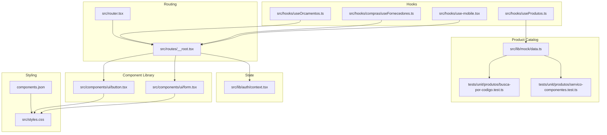

**Diagram sources**
- [src/router.tsx:1-17](file://src/router.tsx#L1-L17)
- [src/routes/__root.tsx:1-123](file://src/routes/__root.tsx#L1-L123)
- [src/components/ui/button.tsx:1-50](file://src/components/ui/button.tsx#L1-L50)
- [src/components/ui/form.tsx:1-172](file://src/components/ui/form.tsx#L1-L172)
- [src/hooks/useOrcamentos.ts:1-132](file://src/hooks/useOrcamentos.ts#L1-L132)
- [src/hooks/compras/useFornecedores.ts:1-31](file://src/hooks/compras/useFornecedores.ts#L1-L31)
- [src/hooks/use-mobile.tsx:1-20](file://src/hooks/use-mobile.tsx#L1-L20)
- [src/lib/auth/context.tsx:1-123](file://src/lib/auth/context.tsx#L1-L123)
- [src/lib/mock/data.ts:1-319](file://src/lib/mock/data.ts#L1-L319)
- [src/hooks/useProdutos.ts:1-181](file://src/hooks/useProdutos.ts#L1-L181)
- [tests/unit/produtos/busca-por-codigo.test.ts:1-118](file://tests/unit/produtos/busca-por-codigo.test.ts#L1-L118)
- [tests/unit/produtos/servico-componentes.test.ts:1-99](file://tests/unit/produtos/servico-componentes.test.ts#L1-L99)
- [src/styles.css:1-188](file://src/styles.css#L1-L188)
- [components.json:1-23](file://components.json#L1-L23)

**Section sources**
- [src/router.tsx:1-17](file://src/router.tsx#L1-L17)
- [src/routes/__root.tsx:1-123](file://src/routes/__root.tsx#L1-L123)
- [src/styles.css:1-188](file://src/styles.css#L1-L188)
- [components.json:1-23](file://components.json#L1-L23)

## Core Components
- Component Library: Built on Radix UI with Tailwind-based variants via class-variance-authority and clsx/tailwind-merge. Each primitive exposes a consistent prop interface and supports variant/size customization.
- Form System: React Hook Form with Zod resolvers and a typed form field composition using Radix UI labels and slots for accessibility.
- Hooks Pattern: TanStack React Query for queries and mutations, with feature-specific hooks encapsulating Supabase data access and optimistic updates.
- Routing: TanStack Router with a root shell that wires QueryClientProvider and AuthProvider, enabling global caching and auth-aware rendering.
- Styling: Tailwind CSS with a custom design system using oklch color tokens and semantic CSS variables mapped to Tailwind utilities.
- **Enhanced Product Catalog**: Comprehensive mock data system with standardized product codes, pricing structures, and service component definitions supporting 37 products across 6 categories and 27 composite services.

**Section sources**
- [src/components/ui/button.tsx:1-50](file://src/components/ui/button.tsx#L1-L50)
- [src/components/ui/form.tsx:1-172](file://src/components/ui/form.tsx#L1-L172)
- [src/hooks/useOrcamentos.ts:1-132](file://src/hooks/useOrcamentos.ts#L1-L132)
- [src/router.tsx:1-17](file://src/router.tsx#L1-L17)
- [src/routes/__root.tsx:1-123](file://src/routes/__root.tsx#L1-L123)
- [src/styles.css:1-188](file://src/styles.css#L1-L188)
- [src/lib/mock/data.ts:102-123](file://src/lib/mock/data.ts#L102-L123)

## Architecture Overview
The runtime architecture centers on TanStack Router's root route providing a QueryClientProvider and AuthProvider to all nested routes. Feature pages consume typed hooks that integrate with Supabase and React Query for data synchronization and optimistic UI updates. The component library ensures consistent styling and behavior across the app. The enhanced product catalog system provides comprehensive mock data for development and testing, supporting detailed product and service definitions with standardized pricing structures.

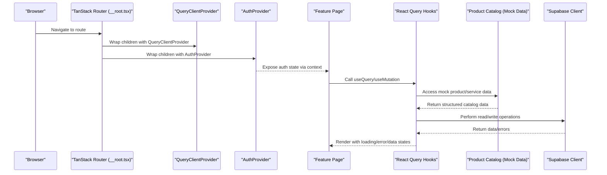

**Diagram sources**
- [src/routes/__root.tsx:112-122](file://src/routes/__root.tsx#L112-L122)
- [src/router.tsx:5-16](file://src/router.tsx#L5-L16)
- [src/hooks/useOrcamentos.ts:1-132](file://src/hooks/useOrcamentos.ts#L1-L132)
- [src/lib/mock/data.ts:102-123](file://src/lib/mock/data.ts#L102-L123)

## Detailed Component Analysis

### Component Library: Radix UI + Tailwind Variants
The component library leverages Radix UI primitives with Tailwind-based variants. Buttons demonstrate a clean separation of concerns: a variant factory defines classes per variant/size, while the component accepts standard HTML attributes and an optional slot-based composition for semantic wrappers.

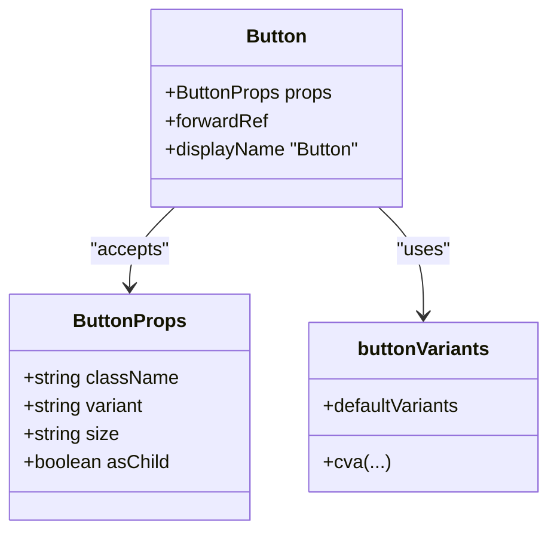

**Diagram sources**
- [src/components/ui/button.tsx:34-47](file://src/components/ui/button.tsx#L34-L47)
- [src/components/ui/button.tsx:7-32](file://src/components/ui/button.tsx#L7-L32)

Key characteristics:
- Prop interfaces: Standard HTML attributes plus variant/size enums and asChild slot support
- Composition: Uses Radix UI Slot for semantic composition
- Styling: Tailwind utilities with semantic CSS variables from the design system

**Section sources**
- [src/components/ui/button.tsx:1-50](file://src/components/ui/button.tsx#L1-L50)
- [src/styles.css:21-74](file://src/styles.css#L21-L74)

### Form System: React Hook Form + Zod + Radix UI
The form system composes React Hook Form primitives with Radix UI labels and slots. It provides a typed FormField context, accessible controls, and integrated error messaging. The FormLabel, FormControl, and FormMessage components ensure ARIA compliance and consistent styling.

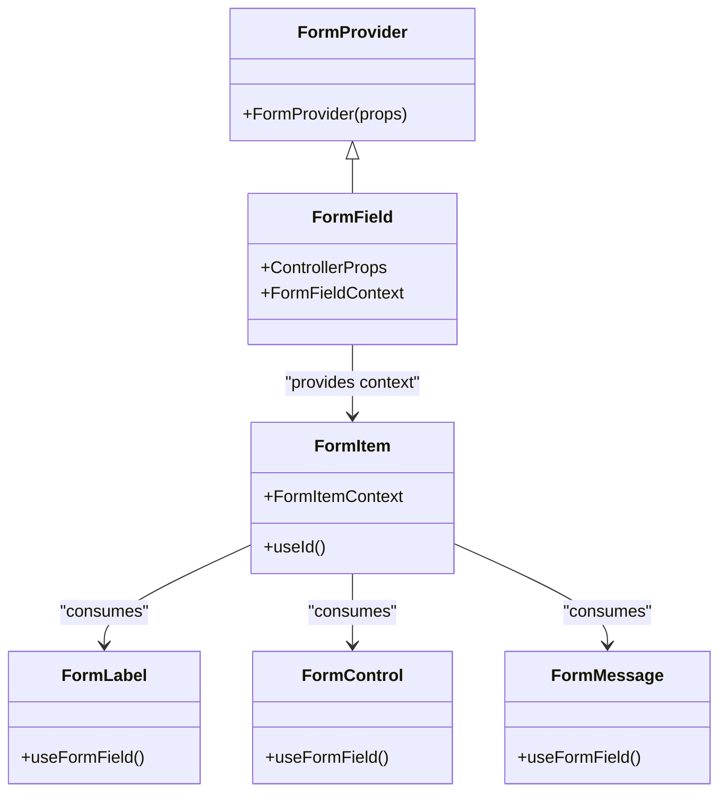

**Diagram sources**
- [src/components/ui/form.tsx:16-171](file://src/components/ui/form.tsx#L16-L171)

Accessibility and composition:
- useFormField integrates with useFormContext to derive ids and aria attributes
- FormControl sets aria-invalid and aria-describedby dynamically
- FormLabel binds to the form item id for screen readers

**Section sources**
- [src/components/ui/form.tsx:1-172](file://src/components/ui/form.tsx#L1-L172)

### Hook Pattern: TanStack React Query + Supabase
Feature hooks encapsulate data fetching and mutations using React Query. They:
- Define stable query keys scoped to the tenant/feature
- Use Supabase browser client for database operations
- Invalidate related queries after mutations
- Surface loading/error states and toast notifications

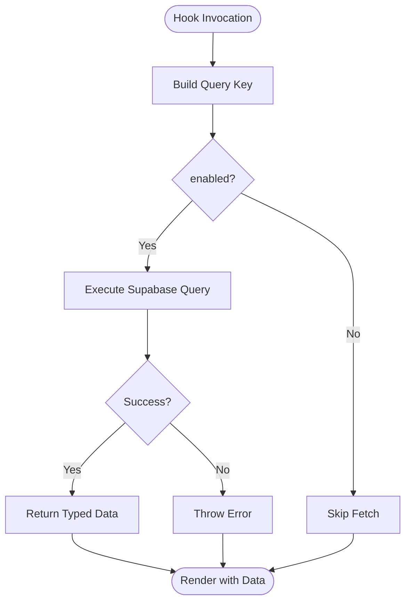

**Diagram sources**
- [src/hooks/useOrcamentos.ts:15-32](file://src/hooks/useOrcamentos.ts#L15-L32)
- [src/hooks/compras/useFornecedores.ts:16-29](file://src/hooks/compras/useFornecedores.ts#L16-L29)

Example patterns:
- useOrcamentos: paginated list with joins and ordering
- useOrcamento: single record fetch with enabled guard
- useOrcamentoMutations: create/update/delete with invalidation and notifications

**Section sources**
- [src/hooks/useOrcamentos.ts:1-132](file://src/hooks/useOrcamentos.ts#L1-L132)
- [src/hooks/compras/useFornecedores.ts:1-31](file://src/hooks/compras/useFornecedores.ts#L1-L31)

### Routing: TanStack Router + File-Based Routes
The router is initialized with a QueryClient in the context and configured for scroll restoration and preloading behavior. The root route configures the shell, providers, head metadata, and error/not-found handlers.

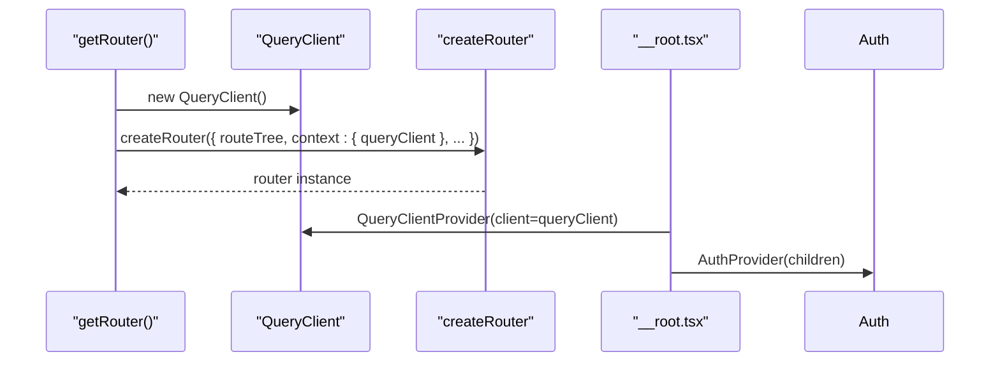

**Diagram sources**
- [src/router.tsx:5-16](file://src/router.tsx#L5-L16)
- [src/routes/__root.tsx:112-122](file://src/routes/__root.tsx#L112-L122)

**Section sources**
- [src/router.tsx:1-17](file://src/router.tsx#L1-L17)
- [src/routes/__root.tsx:1-123](file://src/routes/__root.tsx#L1-L123)

### State Management: Context + React Query + Zustand
- Authentication state: Managed via a React Context provider that restores sessions, lists users, and exposes login/logout/sign-up/reset flows
- Global caching: React Query manages server state and cache invalidation across the app
- UI state: Zustand can be used for transient UI state (e.g., modals, drawers) complementing React Context and React Query

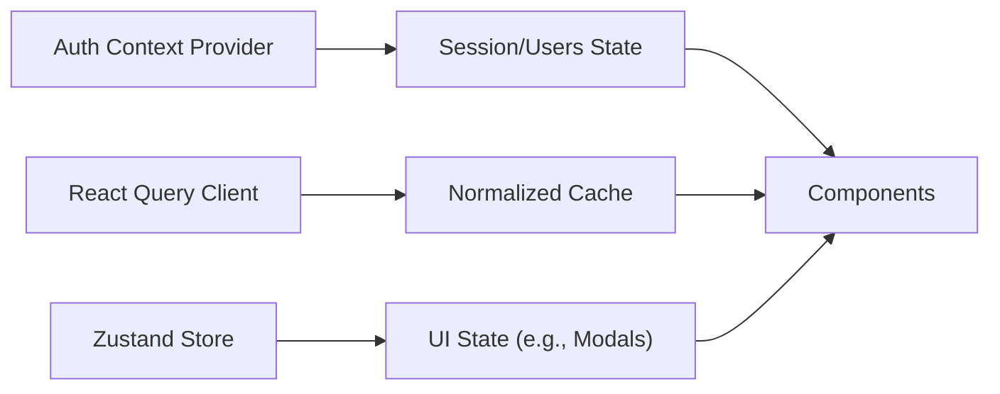

**Diagram sources**
- [src/lib/auth/context.tsx:28-114](file://src/lib/auth/context.tsx#L28-L114)
- [src/router.tsx:6](file://src/router.tsx#L6)

**Section sources**
- [src/lib/auth/context.tsx:1-123](file://src/lib/auth/context.tsx#L1-L123)

### Responsive Design: Mobile-First Strategy
A dedicated hook detects mobile breakpoints and normalizes behavior across devices. The design system uses oklch tokens and Tailwind utilities to ensure consistent spacing and typography at all sizes.

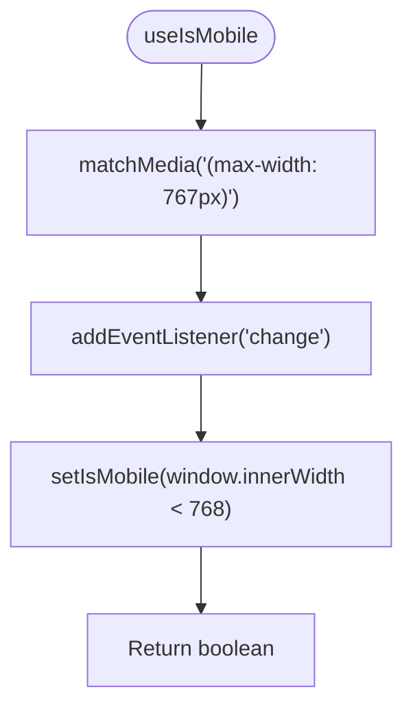

**Diagram sources**
- [src/hooks/use-mobile.tsx:5-18](file://src/hooks/use-mobile.tsx#L5-L18)

**Section sources**
- [src/hooks/use-mobile.tsx:1-20](file://src/hooks/use-mobile.tsx#L1-L20)
- [src/styles.css:1-188](file://src/styles.css#L1-L188)

### Styling System: Tailwind + Custom Design Tokens
The styling system defines a design token layer using oklch color spaces and maps them to Tailwind utilities. Semantic tokens are exposed as CSS variables and themed for light/dark modes. The component library consumes these tokens via Tailwind classes.

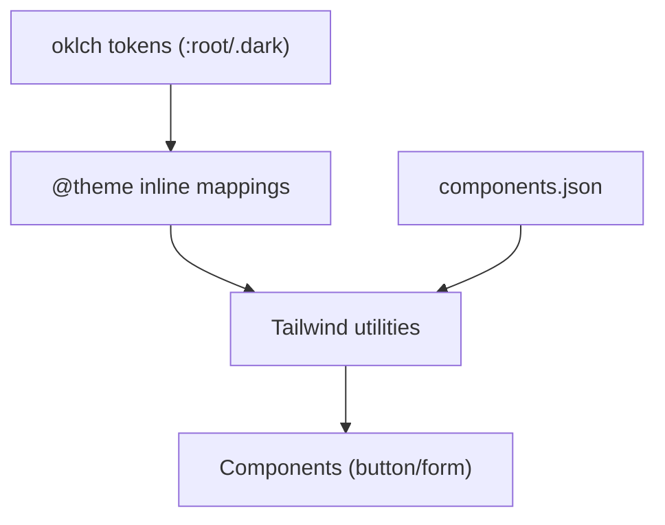

**Diagram sources**
- [src/styles.css:21-74](file://src/styles.css#L21-L74)
- [src/styles.css:76-176](file://src/styles.css#L76-L176)
- [components.json:6-20](file://components.json#L6-L20)

**Section sources**
- [src/styles.css:1-188](file://src/styles.css#L1-L188)
- [components.json:1-23](file://components.json#L1-L23)

## Enhanced Product Catalog System

### Comprehensive Product Catalog Infrastructure
The enhanced mock data system provides a comprehensive product catalog with standardized product codes, pricing structures, and service component definitions. The system supports 37 distinct products across 6 categories and 27 composite services with detailed component hierarchies.

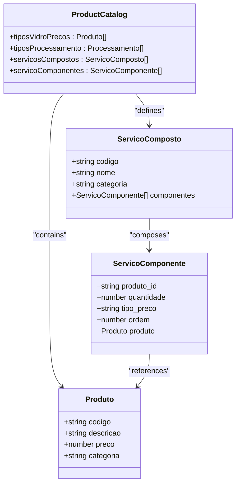

**Diagram sources**
- [src/lib/mock/data.ts:102-123](file://src/lib/mock/data.ts#L102-L123)
- [src/lib/mock/data.ts:134-142](file://src/lib/mock/data.ts#L134-L142)
- [src/lib/mock/data.ts:144-160](file://src/lib/mock/data.ts#L144-L160)

### Standardized Product Codes and Pricing
The catalog implements a systematic approach to product identification with standardized codes:
- **Glass Products**: VI6, VI8, VI10 (Incolor glass), VV8, VV10 (Green/Fume glass), VC4, VC6 (Common glass)
- **Mirror Products**: EB4 (Double-sided mirror), EC4 (Common mirror)
- **Other Products**: VCR4 (Bronze reflective glass)

Each product includes standardized pricing with consistent units and categories for reliable calculations.

**Section sources**
- [src/lib/mock/data.ts:102-123](file://src/lib/mock/data.ts#L102-L123)

### Service Component Definitions
The system defines 27 composite services with detailed component relationships. Services range from simple single-component services (VC4, JT, FPA) to complex multi-component assemblies (PPI8 with 4 components).

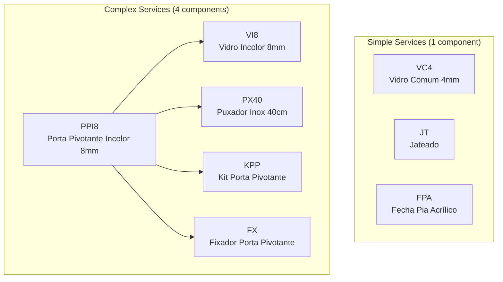

**Diagram sources**
- [tests/unit/produtos/servico-componentes.test.ts:12-40](file://tests/unit/produtos/servico-componentes.test.ts#L12-L40)

### Testing Infrastructure for Product Catalog
The enhanced testing framework validates the product catalog system with comprehensive unit tests:

- **Product Code Validation**: Tests verify correct product lookup for all 37 catalog items
- **Service Component Relationships**: Validates component composition for all 27 services
- **Case Sensitivity**: Ensures product codes are uppercase and case-sensitive
- **Service vs Product Distinction**: Confirms services like PP2V8 are correctly identified as composite services, not individual products

**Section sources**
- [tests/unit/produtos/busca-por-codigo.test.ts:1-118](file://tests/unit/produtos/busca-por-codigo.test.ts#L1-L118)
- [tests/unit/produtos/servico-componentes.test.ts:1-99](file://tests/unit/produtos/servico-componentes.test.ts#L1-L99)

### Integration with Product Management Hooks
The enhanced mock data system integrates seamlessly with the product management hooks:

- **useProdutos**: Lists active products with standardized pricing and categorization
- **useServicosCompostos**: Returns composite services with expanded component details
- **useProdutoPorCodigo**: Provides precise product lookup by standardized code

**Section sources**
- [src/hooks/useProdutos.ts:1-181](file://src/hooks/useProdutos.ts#L1-L181)

## Dependency Analysis
External libraries and their roles:
- TanStack Router: File-based routing with route tree generation and context injection
- TanStack React Query: Data fetching, caching, and invalidation
- Radix UI: Accessible UI primitives
- React Hook Form + Zod: Declarative forms with schema-driven validation
- Tailwind CSS + shadcn/slots: Utility-first styling with design tokens
- Sonner: Toast notifications
- Zustand: Optional lightweight state for UI
- **Enhanced Testing**: Vitest with comprehensive unit tests for product catalog validation

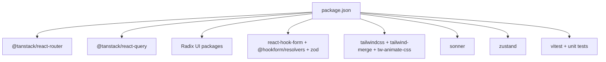

**Diagram sources**
- [package.json:20-78](file://package.json#L20-L78)

**Section sources**
- [package.json:1-102](file://package.json#L1-L102)

## Performance Considerations
- Prefer stable query keys and targeted invalidations to minimize unnecessary refetches
- Use enabled guards in hooks to avoid fetching until dependencies are ready
- Leverage scroll restoration and preload settings in the router for smoother navigation
- Keep component renders minimal by composing small, focused primitives
- Use CSS containment and isolation for heavy lists/modals to improve layout performance
- **Optimize Product Catalog**: The enhanced mock data system provides efficient in-memory access patterns for product and service lookups

## Troubleshooting Guide
Common issues and resolutions:
- Query errors: Ensure error boundaries are present in the root route and handle fallback UI gracefully
- Auth state not persisting: Verify the AuthProvider lifecycle and session restoration flow
- Form validation errors: Confirm Zod resolver is attached and form fields are wrapped with FormField/FormLabel/FormControl/FormMessage
- Responsive layout glitches: Check useIsMobile usage and ensure Tailwind breakpoints align with the hook threshold
- **Product Catalog Issues**: Verify product codes match standardized formats and service component relationships are correctly defined
- **Mock Data Validation**: Ensure all 37 products and 27 services are properly represented in the mock data system

**Section sources**
- [src/routes/__root.tsx:36-69](file://src/routes/__root.tsx#L36-L69)
- [src/lib/auth/context.tsx:33-46](file://src/lib/auth/context.tsx#L33-L46)
- [src/components/ui/form.tsx:40-65](file://src/components/ui/form.tsx#L40-L65)
- [src/hooks/use-mobile.tsx:8-16](file://src/hooks/use-mobile.tsx#L8-L16)
- [src/lib/mock/data.ts:102-123](file://src/lib/mock/data.ts#L102-L123)

## Conclusion
AllVidros employs a modern, scalable frontend architecture centered on TanStack Router, a robust component library built on Radix UI and Tailwind, and a comprehensive data-fetching strategy with TanStack React Query. The form system integrates React Hook Form and Zod for type-safe validation, while the styling system enforces design consistency through oklch-based tokens. The mobile-first responsive strategy and accessible composition patterns ensure a high-quality user experience across devices. The enhanced product catalog system with comprehensive mock data infrastructure provides a solid foundation for development and testing, supporting detailed product and service definitions with standardized pricing structures and component relationships.

## Appendices

### Guidelines for Extending the Component Library
- Base primitives: Start from Radix UI and wrap with Tailwind classes; expose a variant/size factory using class-variance-authority
- Prop interfaces: Accept standard HTML attributes and add explicit variant/size enums; support asChild for semantic composition
- Accessibility: Bind labels to inputs, manage aria-invalid and aria-describedby, and ensure keyboard navigation
- Styling: Consume semantic CSS variables from the design system; keep variants minimal and consistent
- Testing: Provide storybook stories and unit tests for variants and composition

**Section sources**
- [src/components/ui/button.tsx:34-47](file://src/components/ui/button.tsx#L34-L47)
- [src/styles.css:21-74](file://src/styles.css#L21-L74)

### Maintaining Design Consistency
- Centralize design tokens in the CSS theme and reference them via Tailwind utilities
- Use the component library for all UI elements to enforce uniformity
- Align responsive thresholds with the mobile hook and Tailwind breakpoints
- Document component APIs and variant matrices to guide future contributions

**Section sources**
- [src/styles.css:76-176](file://src/styles.css#L76-L176)
- [components.json:6-20](file://components.json#L6-L20)
- [src/hooks/use-mobile.tsx:3](file://src/hooks/use-mobile.tsx#L3)

### Enhancing the Product Catalog System
- **Standardized Product Codes**: Maintain consistent naming conventions across all product categories
- **Comprehensive Service Definitions**: Expand service component relationships to cover all manufacturing processes
- **Testing Coverage**: Ensure all new products and services are validated through unit tests
- **Mock Data Maintenance**: Keep mock data synchronized with production requirements and business logic
- **Performance Optimization**: Monitor memory usage and optimize product catalog access patterns

**Section sources**
- [src/lib/mock/data.ts:102-123](file://src/lib/mock/data.ts#L102-L123)
- [tests/unit/produtos/busca-por-codigo.test.ts:95-104](file://tests/unit/produtos/busca-por-codigo.test.ts#L95-L104)
- [tests/unit/produtos/servico-componentes.test.ts:52-54](file://tests/unit/produtos/servico-componentes.test.ts#L52-L54)