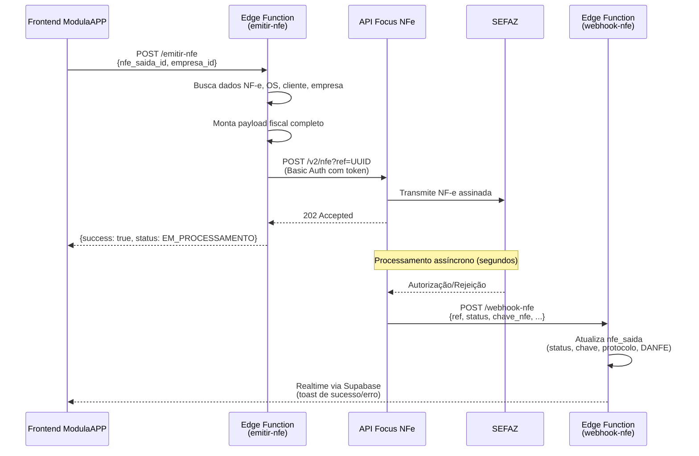

# Análise Fiscal — Focus NFe → Clip Store

## 1. Estado Atual da Integração com Focus NFe

A implementação fiscal está **completa e funcional**, com integração real via API REST da Focus NFe. Abaixo o inventário de tudo que toca o Focus NFe:

### 📦 Edge Functions (Supabase) — Backend

| Função | Arquivo | O que faz | Referência Focus NFe |
|--------|---------|-----------|---------------------|
| **emitir-nfe** | [index.ts](file:///e:/VS%20Code/AllVidros/supabase/functions/emitir-nfe/index.ts) | Monta payload completo da NF-e e envia `POST` à API Focus | URL: `api.focusnfe.com.br/v2/nfe?ref=` |
| **cancelar-nfe** | [index.ts](file:///e:/VS%20Code/AllVidros/supabase/functions/cancelar-nfe/index.ts) | Envia `DELETE` à API Focus para cancelar nota na SEFAZ | URL: `api.focusnfe.com.br/v2/nfe/{ref}` |
| **webhook-nfe** | [index.ts](file:///e:/VS%20Code/AllVidros/supabase/functions/webhook-nfe/index.ts) | Recebe callbacks da Focus NFe quando SEFAZ autoriza/rejeita | Mapeia status: `autorizado→EMITIDA`, `cancelado→CANCELADA`, etc. |
| **config-fiscal** | [index.ts](file:///e:/VS%20Code/AllVidros/supabase/functions/config-fiscal/index.ts) | Salva/lê token Focus NFe na tabela `empresa_secrets` | Chaves: `focus_nfe_token`, `focus_nfe_ambiente` |
| **enviar-nfe-email** | [index.ts](file:///e:/VS%20Code/AllVidros/supabase/functions/enviar-nfe-email/index.ts) | Envia e-mail com dados da NF-e via **Resend** (independente do Focus) | ❌ Não depende do Focus |

### 🖥️ Frontend (React / TanStack)

| Componente | Arquivo | Referências Focus NFe |
|-----------|---------|----------------------|
| **Config Fiscal** | [_app.config.tsx](file:///e:/VS%20Code/AllVidros/src/routes/_app.config.tsx#L522-L593) | Label "Focus NFe", campo de token, switch produção/homologação |
| **Modal Emitir** | [ModalEmitirNfe.tsx](file:///e:/VS%20Code/AllVidros/src/components/features/fiscal/ModalEmitirNfe.tsx) | ✅ Genérico — não menciona Focus |
| **Página Fiscal** | [_app.fiscal.tsx](file:///e:/VS%20Code/AllVidros/src/routes/_app.fiscal.tsx) | Usa `focus_nfe_ref` para verificar se pode cancelar |
| **Hook useFiscalData** | [useFiscalData.ts](file:///e:/VS%20Code/AllVidros/src/hooks/useFiscalData.ts) | Interface `NfeSaida` com campo `focus_nfe_ref` |
| **Types Supabase** | [types.ts](file:///e:/VS%20Code/AllVidros/src/lib/supabase/types.ts) | Coluna `focus_nfe_ref` no schema |

### 📄 Documentação

| Documento | Arquivo |
|-----------|---------|
| Requisitos de Produção | [integracao_fiscal_producao.md](file:///e:/VS%20Code/AllVidros/docs/integracao_fiscal_producao.md) |
| Guia de Ativação | [guia-ativacao-nfe.md](file:///e:/VS%20Code/AllVidros/docs/guia-ativacao-nfe.md) |

### 🗄️ Banco de Dados

- Tabela `nfe_saida`: coluna `focus_nfe_ref` (VARCHAR) — armazena a referência única da nota no Focus
- Tabela `empresa_secrets`: chaves `focus_nfe_token` e `focus_nfe_ambiente`

---

## 2. Fluxo Completo Atual

---

## 3. Sobre o Clip Store (Clipp Store / Zucchetti)

> [!CAUTION]
> **O Clip Store NÃO é um provedor de API fiscal.** Ele é um **software de gestão comercial fechado** (ERP de prateleira), vendido pela Compufour/Zucchetti.

### O que o Clip Store é:
- Um **programa desktop** para gerenciamento de loja (PDV, estoque, financeiro)
- Possui **módulo interno** de emissão de NF-e/NFC-e
- A emissão é feita **dentro da interface do próprio software**
- **Não oferece API pública** para integração com sistemas de terceiros

### Por que NÃO funciona como substituto do Focus NFe:

| Critério | Focus NFe | Clip Store |
|----------|-----------|------------|
| **Tipo** | API REST para desenvolvedores | Software desktop fechado |
| **API pública** | ✅ Sim, documentada | ❌ Não existe |
| **Integração via código** | ✅ JSON + HTTP | ❌ Impossível programaticamente |
| **Webhook de retorno** | ✅ Sim | ❌ Não |
| **Uso com Supabase/Edge Functions** | ✅ Perfeito | ❌ Incompatível |
| **Custo** | ~R$49/mês (API) | ~R$120–300/mês (licença software) |

> [!IMPORTANT]
> **Migrar para o Clip Store significaria abandonar toda a integração automática** e voltar a emitir notas manualmente em outro software, perdendo a conexão direta com o VidraERP.

---

## 4. Opções Reais de Migração

Se você deseja **trocar o Focus NFe por outro provedor de API**, as alternativas viáveis são:

| Provedor | API REST | Preço | Complexidade de Migração |
|----------|----------|-------|--------------------------|
| **Nuvem Fiscal** | ✅ | A partir de R$39/mês | 🟡 Média — payload similar |
| **eNotas** | ✅ | A partir de R$59/mês | 🟡 Média — payload diferente |
| **TecnoSpeed (PlugNotas)** | ✅ | Sob consulta | 🔴 Alta — SDK próprio |
| **Sefaz Direto** (sem intermediário) | ✅ (SOAP/XML) | Grátis | 🔴 Muito alta — XML signing manual |

Todos esses mantêm a mesma arquitetura: **Edge Function → API fiscal → SEFAZ → Webhook de retorno**.

---

## 5. Decisão Necessária

Preciso que você me diga:

1. **Você quer usar o Clip Store como software paralelo** (emitir notas lá fora do VidraERP, manualmente)?
   - Nesse caso, podemos **desativar o módulo fiscal do VidraERP** ou deixar apenas como consulta/registros

2. **Você quer trocar por outro provedor de API** que não seja o Focus NFe?
   - Nesse caso, me diga qual provedor e eu adapto as 4 Edge Functions + config

3. **Você já tem uma conta/contrato com o Clip Store** e quer entender como usar os dois juntos?
   - Posso criar um fluxo híbrido: registrar no VidraERP + emitir manual no Clip Store

---

## 6. Resumo do Impacto

Se decidir migrar para outro provedor de API:

| Item | Arquivos a alterar | Esforço |
|------|--------------------|---------|
| Edge Function `emitir-nfe` | 1 arquivo, ~100 linhas | Reescrever payload + chamada HTTP |
| Edge Function `cancelar-nfe` | 1 arquivo, ~40 linhas | Adaptar endpoint de cancelamento |
| Edge Function `webhook-nfe` | 1 arquivo, ~50 linhas | Adaptar mapeamento de status |
| Edge Function `config-fiscal` | 1 arquivo, ~30 linhas | Renomear chaves de `focus_nfe_*` |
| Frontend `_app.config.tsx` | ~20 linhas | Labels e placeholders |
| Banco de dados | 1 coluna + 2 secrets | Renomear `focus_nfe_ref` |
| Documentação | 2 arquivos | Reescrever guia |
