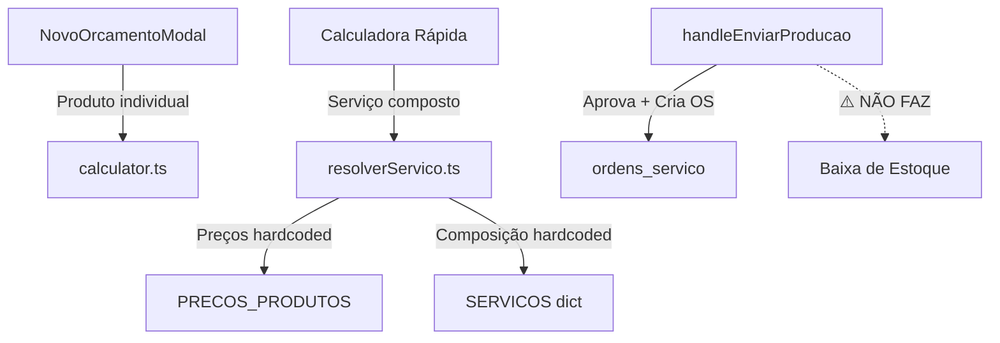
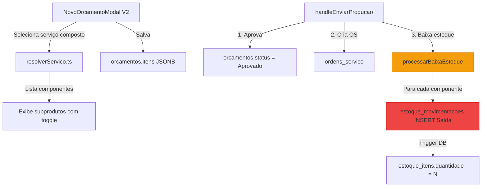
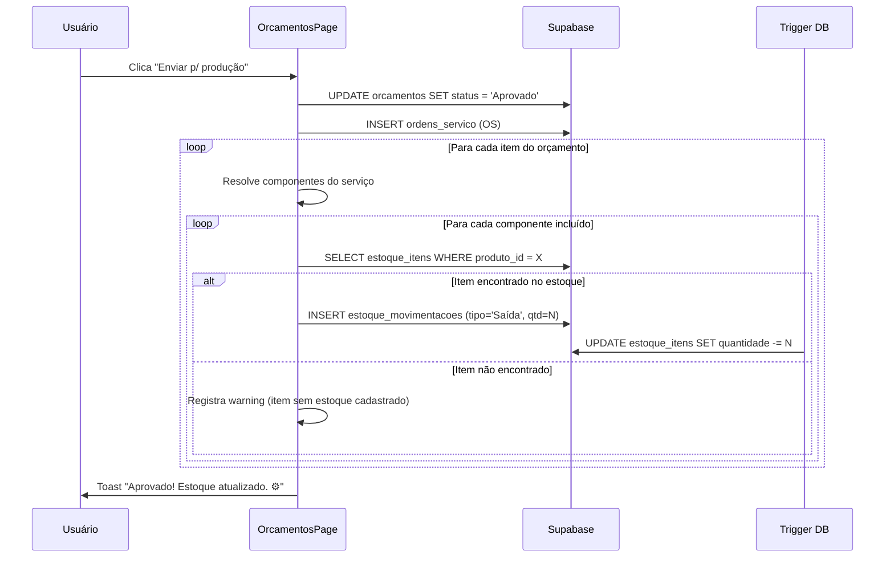

# 🏗️ Plano de Implementação — Kits Automáticos + Baixa de Estoque

## Visão Geral

Implementar um sistema onde, ao selecionar um **serviço composto** (ex: Box Incolor) no orçamento, todos os subprodutos necessários são exibidos e incluídos automaticamente. Ao aprovar o orçamento e enviar para produção, o estoque de cada componente é decrementado automaticamente.

---

## Arquitetura Atual (Diagnóstico)



> [!IMPORTANT]
> Existem **dois fluxos paralelos** de orçamento:
> 1. **NovoOrcamentoModal** — usa `calculator.ts` com produtos individuais (vidro + processamento)
> 2. **Calculadora Rápida** (na página) — usa `resolverServico.ts` com serviços compostos (PPI8, BI, etc.)
> 
> O modal de criação **não suporta serviços compostos** — apenas produtos avulsos.

---

## Arquitetura Alvo



---

## Fases de Implementação

### Fase 1 — Vincular Produtos do Catálogo ao Estoque
> **Prioridade:** Alta | **Esforço:** Baixo | **Risco:** Baixo

#### Problema
A tabela `produtos` (catálogo) e `estoque_itens` são **independentes** — não há FK entre elas. Para a baixa automática funcionar, precisamos saber qual `estoque_itens.id` corresponde a cada `produtos.codigo`.

#### Solução
Adicionar coluna `produto_id` na tabela `estoque_itens` como referência opcional ao catálogo.

#### Arquivos a Criar/Modificar

| Arquivo | Ação | Descrição |
|---------|------|-----------|
| `supabase/migrations/20260617_vincular_estoque_produtos.sql` | 🆕 Criar | Migration: adicionar `produto_id UUID REFERENCES produtos(id)` em `estoque_itens` |
| `src/hooks/useEstoque.ts` | ✏️ Editar | Incluir `produto_id` no tipo e nas mutations |
| `src/routes/_app.estoque.tsx` | ✏️ Editar | Exibir vínculo com produto no formulário de estoque |

#### SQL da Migration
```sql
-- Vincular estoque ao catálogo de produtos
ALTER TABLE estoque_itens 
  ADD COLUMN IF NOT EXISTS produto_id UUID REFERENCES produtos(id);

CREATE INDEX IF NOT EXISTS idx_estoque_itens_produto 
  ON estoque_itens(produto_id);

-- Atualizar itens existentes por código (best-effort)
UPDATE estoque_itens ei
SET produto_id = p.id
FROM produtos p
WHERE ei.codigo = p.codigo 
  AND ei.empresa_id = p.empresa_id
  AND ei.produto_id IS NULL;
```

#### Critérios de Aceitação
- [ ] Coluna `produto_id` existe em `estoque_itens`
- [ ] Itens existentes vinculados automaticamente por código
- [ ] Hook `useEstoque` retorna `produto_id`

---

### Fase 2 — Unificar o Modal de Orçamento com Serviços Compostos
> **Prioridade:** Alta | **Esforço:** Médio | **Risco:** Médio

#### Problema
O `NovoOrcamentoModal` usa apenas produtos individuais (`produtoCodigo`), enquanto a calculadora rápida usa serviços compostos (`codigoServico`). Precisamos que o modal permita selecionar **serviços compostos** e exiba seus componentes.

#### Solução
Refatorar o `NovoOrcamentoModal` para:
1. Oferecer seleção de **serviço composto** (ex: Box Incolor = BI + KA + KAB)
2. Exibir lista de subprodutos com checkboxes (habilitados por padrão)
3. Permitir incluir/excluir subprodutos individuais
4. Salvar no JSONB os dados do serviço + componentes selecionados

#### Arquivos a Criar/Modificar

| Arquivo | Ação | Descrição |
|---------|------|-----------|
| `src/components/features/orcamentos/NovoOrcamentoModal.tsx` | ✏️ Refatorar | Adicionar seleção de serviço composto + subprodutos |
| `src/components/features/orcamentos/SubprodutosLista.tsx` | 🆕 Criar | Componente que lista os subprodutos com toggle |
| `src/lib/sales/types.ts` | ✏️ Editar | Adicionar tipo `OrcamentoItemComComponentes` |

#### Novo Tipo de Dados
```typescript
export interface OrcamentoItemUnificado {
  // Identificação do serviço
  codigoServico: string;
  nomeServico: string;
  
  // Dimensões
  largura: number;  // metros (para calculadora rápida) ou mm (para modal)
  altura: number;
  quantidade: number;
  adicional: number;
  
  // Componentes do kit (expandidos)
  componentes: {
    codigoProduto: string;
    descricao: string;
    quantidade: number;
    tipoPreco: TipoPreco;
    incluido: boolean;  // toggle do usuário
  }[];
}
```

#### Critérios de Aceitação
- [ ] Modal oferece dropdown com serviços compostos (PPI8, BI, BV, etc.)
- [ ] Ao selecionar um serviço, subprodutos aparecem com checkboxes ✅
- [ ] Subprodutos habilitados por padrão, mas podem ser desmarcados
- [ ] Cálculo de preço reflete apenas componentes marcados
- [ ] JSONB do orçamento salva serviço + componentes com flag `incluido`

---

### Fase 3 — Baixa Automática de Estoque na Aprovação
> **Prioridade:** Alta | **Esforço:** Médio | **Risco:** Alto

#### Problema
Ao clicar "Enviar p/ produção" (`handleEnviarProducao`), o sistema aprova o orçamento e cria uma OS, mas **não toca no estoque**. Os componentes precisam ser decrementados.

#### Solução
Criar função `processarBaixaEstoque()` que:
1. Lê os itens do orçamento (JSONB)
2. Para cada item, resolve os componentes do serviço composto
3. Para cada componente com `incluido: true`, busca o `estoque_itens` correspondente via `produto_id` ou `codigo`
4. Insere uma `estoque_movimentacoes` do tipo `Saída`
5. O trigger existente `trg_aplicar_movimentacao` atualiza automaticamente a quantidade

#### Arquivos a Criar/Modificar

| Arquivo | Ação | Descrição |
|---------|------|-----------|
| `src/lib/estoque/processarBaixaEstoque.ts` | 🆕 Criar | Função principal de baixa automática |
| `src/hooks/useEstoque.ts` | ✏️ Editar | Adicionar mutation `baixarEstoqueOrcamento` |
| `src/routes/_app.orcamentos.tsx` | ✏️ Editar | Chamar `processarBaixaEstoque` em `handleEnviarProducao` |

#### Fluxo Detalhado



#### Lógica de Cálculo de Quantidade

| Tipo Preço | Fórmula da Quantidade para Baixa |
|------------|----------------------------------|
| `M2` | `m² calculado × quantidade_componente` |
| `PC_FX` | `quantidade_peca × quantidade_componente` |
| `PC_ML` | `largura_metros × quantidade_componente × quantidade_peca` |

#### Código Core (pseudocódigo)
```typescript
async function processarBaixaEstoque(
  orcamento: Orcamento,
  supabase: SupabaseClient,
  empresaId: string
) {
  const itens = orcamento.itens as OrcamentoItemUnificado[];
  const erros: string[] = [];
  
  for (const item of itens) {
    const servico = resolverServico(item.codigoServico);
    const componentesAtivos = item.componentes?.filter(c => c.incluido) 
      ?? servico.componentes; // fallback para itens antigos
    
    for (const comp of componentesAtivos) {
      // Calcular quantidade a dar baixa
      let qtdBaixa: number;
      if (comp.tipoPreco === 'M2') {
        const m2 = item.largura * item.altura * item.quantidade;
        qtdBaixa = m2 * comp.quantidade;
      } else if (comp.tipoPreco === 'PC_ML') {
        qtdBaixa = item.largura * comp.quantidade * item.quantidade;
      } else {
        qtdBaixa = comp.quantidade * item.quantidade;
      }
      
      // Buscar item no estoque
      const { data: estoqueItem } = await supabase
        .from('estoque_itens')
        .select('id')
        .eq('empresa_id', empresaId)
        .or(`produto_id.eq.${produtoId},codigo.eq.${comp.codigoProduto}`)
        .maybeSingle();
      
      if (!estoqueItem) {
        erros.push(`${comp.codigoProduto}: sem estoque cadastrado`);
        continue;
      }
      
      // Registrar saída
      await supabase.from('estoque_movimentacoes').insert({
        empresa_id: empresaId,
        item_id: estoqueItem.id,
        tipo: 'Saída',
        quantidade: qtdBaixa,
        os_referencia: orcamento.numero,
        observacao: `Baixa automática - ${item.codigoServico}`
      });
    }
  }
  
  return { sucesso: erros.length === 0, erros };
}
```

#### Critérios de Aceitação
- [ ] Ao aprovar orçamento, estoque de cada componente é decrementado
- [ ] Movimentações registradas com referência da OS e observação clara
- [ ] Se estoque insuficiente, exibe warning mas **não bloqueia** a aprovação
- [ ] Items sem cadastro no estoque geram warning, não erro fatal
- [ ] Ao "Remover da produção", estoque é **devolvido** (tipo Devolução)

---

### Fase 4 — Devolução de Estoque ao Cancelar Produção
> **Prioridade:** Média | **Esforço:** Baixo | **Risco:** Baixo

#### Problema
Se o usuário clicar "Remover da produção" após aprovação, os itens já foram decrementados do estoque. Precisamos devolver.

#### Solução
Na função `handleRemoverProducao`, adicionar lógica reversa:
1. Buscar movimentações de saída vinculadas à OS
2. Para cada saída, inserir uma movimentação de `Devolução` com a mesma quantidade

#### Arquivos a Modificar

| Arquivo | Ação | Descrição |
|---------|------|-----------|
| `src/lib/estoque/processarBaixaEstoque.ts` | ✏️ Editar | Adicionar `reverterBaixaEstoque()` |
| `src/routes/_app.orcamentos.tsx` | ✏️ Editar | Chamar reversão em `handleRemoverProducao` |

#### Critérios de Aceitação
- [ ] Ao remover da produção, estoque é restaurado
- [ ] Movimentações de devolução registradas com referência clara
- [ ] Funciona corretamente com orçamentos antigos (sem componentes)

---

### Fase 5 — Indicadores Visuais e Validação de Estoque
> **Prioridade:** Média | **Esforço:** Baixo | **Risco:** Baixo

#### O que implementar
- Badge de alerta no botão "Enviar p/ produção" quando estoque é insuficiente
- Na lista de subprodutos do modal, mostrar estoque disponível ao lado de cada componente
- Toast detalhado após aprovação listando itens com estoque baixo

#### Arquivos a Modificar

| Arquivo | Ação | Descrição |
|---------|------|-----------|
| `src/components/features/orcamentos/SubprodutosLista.tsx` | ✏️ Editar | Mostrar `disponível: X` ao lado de cada componente |
| `src/routes/_app.orcamentos.tsx` | ✏️ Editar | Badge de alerta no dropdown |
| `src/hooks/useEstoque.ts` | ✏️ Editar | Hook `useEstoquePorProdutos(codigos[])` para consulta rápida |

#### Critérios de Aceitação
- [ ] Subprodutos exibem quantidade disponível em estoque
- [ ] Componentes com estoque insuficiente aparecem em vermelho
- [ ] Toast após aprovação lista itens com estoque crítico

---

## Resumo da Ordem de Execução

```mermaid
gantt
    title Implementação Kits + Estoque Automático
    dateFormat X
    axisFormat %s
    
    section Fase 1
    Migration vincular estoque         :f1, 0, 1
    
    section Fase 2
    Modal com serviços compostos       :f2, 1, 3
    Componente SubprodutosLista        :f2b, 1, 2
    
    section Fase 3
    processarBaixaEstoque              :f3, 3, 5
    Integrar em handleEnviarProducao   :f3b, 4, 5
    
    section Fase 4
    Devolução ao cancelar              :f4, 5, 6
    
    section Fase 5
    Indicadores visuais                :f5, 5, 6
```



## Riscos e Mitigações

| Risco | Impacto | Mitigação |
|-------|---------|-----------|
| Estoque insuficiente bloqueia venda | Alto | Warnings, não erros — venda não é bloqueada |
| Orçamentos antigos sem `componentes` no JSONB | Médio | Fallback: resolver componentes via `resolverServico()` |
| Race condition em aprovações simultâneas | Baixo | Trigger DB garante atomicidade por movimentação |
| Produto sem vínculo no estoque | Médio | Logging + toast informativo, sem crash |

---

> [!TIP]
> **Recomendação de execução:** Fases 1→2→3 são sequenciais e obrigatórias. Fases 4 e 5 podem ser feitas em paralelo após a Fase 3.
